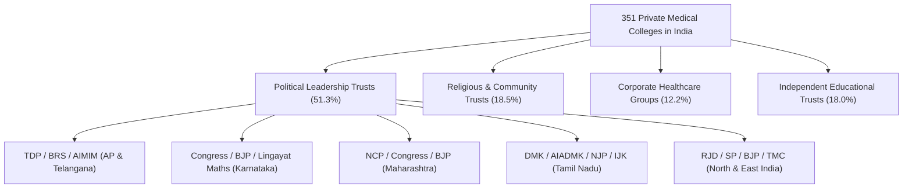
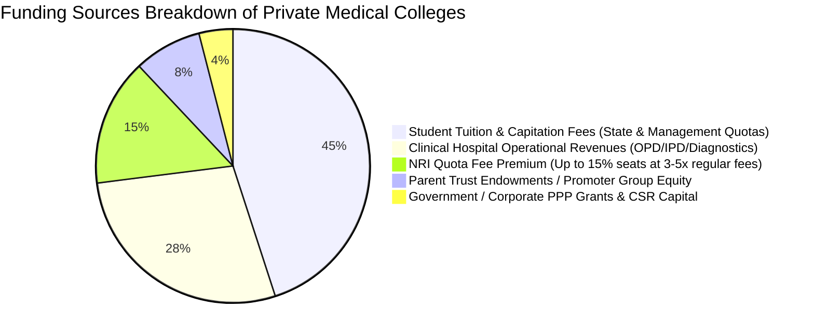

# Executive Report: Ownership, Political Affiliations & Funding Mechanisms of Private Medical Colleges in India

## Executive Summary

Medical education in India has undergone a massive expansion over the past three decades, driven predominantly by **Private Trusts, Educational Societies, and Deemed Universities**. Of the **780 total NMC-recognized medical colleges** offering MBBS programs in India:
- **429 (55.0%)** are Government-owned (Central, State, Autonomous, and Municipal institutes).
- **351 (45.0%)** are managed by non-government entities, categorized officially by the National Medical Commission (NMC) as **Trust (273)**, **Society (48)**, and **Private (30)**.

This report presents a comprehensive investigation into the **ownership structures, key leadership figures, political affiliations, and revenue/funding models** across all **351 non-government medical colleges** across 27 Indian states and Union Territories.

---

## Key Findings & National Statistics

### 1. Management Category Distribution
| Management Type | College Count | Percentage of Private Dataset | Primary Governance Model |
| :--- | :---: | :---: | :--- |
| **Trust** | 273 | 77.8% | Educational, Religious, Charitable, or Family Trusts |
| **Society** | 48 | 13.7% | Registered Educational & Public Charitable Societies |
| **Private / Deemed** | 30 | 8.5% | Private Universities, Section 8 Companies, or Corporate Entities |
| **Total Private Dataset** | **351** | **100.0%** | |

### 2. High Political Nexus
- **51.3% (180 out of 351 colleges)** have **direct or explicit political connections**. The founders, chairmen, managing trustees, or key board members are active or former **Members of Parliament (MPs), Members of Legislative Assembly (MLAs), Cabinet Ministers, State Governors, or political party founders**.
- Political representation spans all major national and regional parties, including **BJP, Indian National Congress (INC), Telugu Desam Party (TDP), Bharat Rashtra Samithi (BRS), Dravida Munnetra Kazhagam (DMK), All India Anna Dravida Munnetra Kazhagam (AIADMK), Nationalist Congress Party (NCP), Rashtriya Janata Dal (RJD), Samajwadi Party (SP), All India Majlis-e-Ittehadul Muslimeen (AIMIM), and Trinamool Congress (TMC)**.

---

## Regional Ownership & Political Landscape Breakdown

### 1. Andhra Pradesh & Telangana (48 Private Colleges)
- **Political Dominance**: Over **70%** of private medical colleges in combined AP/Telangana are owned by prominent political families.
- **TDP Connections**:
  - *Narayana Medical College, Nellore*: Founded by **Dr. Ponguru Narayana**, sitting TDP Cabinet Minister for Municipal Administration & Urban Development and MLA (Nellore City).
  - *GITAM Institute of Medical Sciences, Visakhapatnam*: Founded by late TDP MP **M. V. V. S. Murthi**; currently headed by TDP MP **M. Sribharat** (Visakhapatnam).
  - *Maharajah Institute of Medical Sciences (MIMS), Vizianagaram*: Tied to MANSAS Trust headed by former Union Minister **P. Ashok Gajapathi Raju** (TDP).
  - *ASRAM Eluru*: Founded by former BJP MP **Dr. Gokaraju Ganga Raju** (Laila Group).
- **BRS Connections (Telangana)**:
  - *Malla Reddy Group (MRIMS, MRMCW, CMRIMS)*: Founded by **Ch. Malla Reddy**, former Cabinet Minister for Labour (BRS) and sitting MLA (Medchal).
  - *Mamata Medical College, Khammam & Bachupally*: Managed by former BRS Transport Minister **Puvvada Ajay Kumar** and CPI veteran **Puvvada Nageswara Rao**.
  - *Dr. Patnam Mahender Reddy Institute, Chevella*: Founded by BRS MLC and former Minister **Dr. Patnam Mahender Reddy**.
  - *Mahavir Institute, Vikarabad*: Founded by former BRS MLA **V. Mahipal Reddy**.
- **AIMIM & Minority Trusts**:
  - *Deccan College of Medical Sciences & Dr. VRK Women's College, Hyderabad*: Managed by **Darussalam Educational Trust (DET)**, chaired by AIMIM President & MP **Asaduddin Owaisi** and MLA **Akbaruddin Owaisi**.
  - *Shadan Institute of Medical Sciences, Peerancheru*: Founded by late MLA **Dr. Vizarat Rasool Khan** (AIMIM/TDP).

### 2. Karnataka (49 Private Colleges)
- **Congress Leadership**:
  - *SSIMSRC Davangere & JJM Medical College*: Governed by Bapuji Educational Association, headed by senior Congress Cabinet Minister **Shamanur Shivashankarappa** and Minister **S. S. Mallikarjun**.
  - *Sri Siddhartha Medical College, Tumkur*: Chaired by **Dr. G. Parameshwara**, sitting Home Minister of Karnataka (Congress) and former Deputy CM.
  - *BLDE Association / Shri B.M. Patil Medical College, Vijayapura*: Chaired by **M. B. Patil**, Cabinet Minister for Infrastructure & Large Industries (Congress).
  - *M.S. Ramaiah Medical College, Bangalore*: Governed by Gokula Education Foundation, led by former Congress Minister **M. R. Seetharam**.
  - *Dr. BR Ambedkar & Sri Devaraj Urs Medical Colleges*: Founded by late Union Cabinet Minister **B. R. Jalappa** (Congress).
- **BJP Leadership**:
  - *KLE Society / JNMC Belgaum & Moorusavirmath Hubli*: Chaired by **Dr. Prabhakar Kore**, former three-term BJP Rajya Sabha MP.
  - *PES University Medical College, Bangalore*: Founded by **Dr. M. R. Doreswamy**, former BJP MLC and state education advisor.
  - *Dayananda Sagar University (CDSIMER), Harohalli*: Chaired by former BJP MLA **Dr. D. Hemachandra Sagar**.
  - *S. Nijalingappa Medical College, Bagalkot*: Chaired by former BJP MLA **Dr. Veeranna Charantimath**.
- **Lingayat & Vokkaliga Spiritual Math Trusts**:
  - *BGS Global & AIMS Bellur*: Sri Adichunchanagiri Math (**Sri Sri Sri Dr. Nirmalanandanatha Swamiji**).
  - *Siddaganga Medical College, Tumakuru*: Sri Siddaganga Math (**Sri Siddalinga Swamiji**).
  - *JSS Medical College, Mysore*: JSS Mahavidyapeetha / Suttur Math (**Jagadguru Sri Shivarathri Deshikendra Mahaswamiji**).
  - *SDM Medical College, Dharwad*: Headed by nominated Rajya Sabha MP **Dr. D. Veerendra Heggade** (Dharmasthala).

### 3. Maharashtra (38 Private Colleges)
- **NCP / Congress Alliances**:
  - *MGM Medical Colleges (Navi Mumbai, Aurangabad, Vashi)*: Founded by former Maharashtra Education Minister **Kamalkishor Kadam** (NCP/Congress).
  - *Dr. D. Y. Patil Group (Pimpri, Kolhapur, Navi Mumbai)*: Founded by former Governor **Dr. D. Y. Patil** (Congress); led by Congress MLC & former Minister **Satej (Bunty) Patil**.
  - *Bharati Vidyapeeth (Pune, Sangli)*: Founded by late Cabinet Minister **Patangrao Kadam** (Congress); led by Congress MLA **Vishwajeet Kadam**.
  - *Terna Medical College, Navi Mumbai*: Founded by former Home Minister **Padmasinh Patil** (NCP); led by BJP MLA **Rana Jagjit-singh Patil**.
  - *NKP Salve Institute, Nagpur*: Founded by former Congress Minister **Ranjit Deshmukh** and named after Union Minister **N. K. P. Salve**.
- **BJP Leadership**:
  - *Pravara Institute & DVVP Foundation, Ahmednagar*: Chaired by **Radhakrishna Vikhe Patil**, Cabinet Minister for Revenue (BJP), and former MP **Dr. Sujay Vikhe Patil**.
  - *Datta Meghe Institute (DMIHER), Wardha & Nagpur*: Founded by four-time MP **Datta Meghe**; led by BJP MLA **Sameer Meghe**.
  - *SSPM Medical College, Sindhudurg*: Founded by former Chief Minister & Union Minister **Narayan Rane** (BJP MP) and BJP MLA **Nitesh Rane**.
  - *Krishna Institute (KIMS), Karad*: Chaired by BJP political leader **Dr. Suresh Bhosale**.

### 4. Tamil Nadu & Pondicherry (46 Private Colleges)
- **DMK Leadership**:
  - *BIHER Group (Sree Balaji, JR, Bhaarat, Sri Lakshmi Narayana)*: Founded by **Dr. S. Jagathrakshakan**, senior DMK MP (Arakkonam) and former Union Minister.
  - *Karpaga Vinayaga Institute, Maduranthagam*: Founded by **S. Regupathy**, Cabinet Minister for Law (DMK).
  - *Arunai Medical College, Tiruvannamalai*: Founded by **E. V. Velu**, Cabinet Minister for Public Works & Highways (DMK).
  - *Indira Medical College, Tiruvallur*: Founded by sitting DMK MLA **VG Raajendran**.
- **AIADMK / Regional Parties**:
  - *St. Peter's Medical College, Hosur*: Connected to family of senior AIADMK MP and former Deputy Speaker **M. Thambidurai**.
  - *Rajarajeswari & ACS Medical Colleges, Chennai*: Founded by **Dr. A. C. Shanmugam**, former MP/MLA and founder of New Justice Party.
  - *SRM Group (Kancheepuram & Trichy)*: Founded by former MP **Dr. T. R. Paarivendhar** (P. Pachamuthu), founder of Indhiya Jananayaga Katchi (IJK).
  - *Vels Medical College, Tiruvallur*: Chaired by film producer & political figure **Dr. Ishari K. Ganesh**.

### 5. North, Central & East India (94 Private Colleges)
- **Uttar Pradesh**:
  - *Shri Gorakshnath Medical College, Gorakhpur*: Chaired by **Yogi Adityanath**, Chief Minister of Uttar Pradesh and Head Seer of Gorakhnath Math.
  - *Teerthanker Mahaveer University, Moradabad*: Chaired by former BJP figure **Suresh Jain** (Jain Minority Deemed).
  - *Major SD Singh (Farrukhabad) & Prasad (Lucknow)*: Founded by Samajwadi Party leaders (**Dr. Anar Singh Yadav** & **B. P. Yadav**).
  - *Noida International University (NIIMS)*: Chaired by former UP DGP **Dr. Vikram Singh**.
- **Bihar & Jharkhand**:
  - *Katihar Medical College*: Founded by former RJD Rajya Sabha MP **Ahmad Ashfaque Karim**.
  - *Madhubani Medical College*: Founded by sitting RJD Rajya Sabha MP **Dr. Faiyaz Ahmad**.
  - *Narayan Medical College, Sasaram*: Founded by former BJP Rajya Sabha MP **Gopal Narayan Singh**.
  - *Laxmi Chandravansi Medical College, Bishrampur (Jharkhand)*: Founded by former Jharkhand Health Minister **Ramchandra Chandravansi** (BJP).
- **Odisha, Punjab, Haryana & Gujarat**:
  - *KIMS Bhubaneswar*: Founded by former BJD Lok Sabha MP **Dr. Achyuta Samanta** (KIIT).
  - *Maharaja Agrasen Medical College, Agroha (Haryana)*: Chaired by Haryana Cabinet Minister **Savitri Jindal** and MP **Naveen Jindal**.
  - *Banas Medical College, Palanpur (Gujarat)*: Chaired by **Shankar Chaudhary**, Speaker of the Gujarat Legislative Assembly (BJP).
  - *Sri Guru Ram Das Institute, Amritsar*: Governed by **SGPC (Shiromani Gurdwara Parbandhak Committee)**.

---

## Funding & Revenue Mechanics

Private medical colleges in India operate under a high-capital, high-revenue financial framework. The primary funding sources identified across the 351 institutions include:

1. **Student Tuition & Fee Structure**:
   - **Government Quota Seats (30-50%)**: Regulated state fee committee rates (approx. ₹4 Lakh - ₹10 Lakh per annum).
   - **Management Quota Seats (35-50%)**: Higher fee slabs (approx. ₹12 Lakh - ₹25 Lakh per annum).
   - **NRI Quota Seats (15%)**: Premium USD-denominated pricing (approx. $25,000 - $45,000 per annum), yielding massive cross-subsidization margins for promoters.
2. **Hospital Clinical Revenue**:
   - Private medical colleges are mandated by NMC to maintain 500 to 1,500+ bed teaching hospitals. High-volume clinical OPD/IPD charges, diagnostic services, super-specialty surgeries, and government health scheme reimbursements (e.g., Ayushman Bharat PM-JAY, Mahatma Jyotika Phule Jan Arogya Yojana, YSR Aarogyasri) form a core operational cash flow.
3. **Corporate Healthcare & Industrial Backing**:
   - Corporate groups (Apollo Hospitals, Max/Manipal MEMG, Zydus Lifesciences, Adani Foundation, Kovai Medical Center KMCH, Aster DM Healthcare) leverage enterprise capital and corporate CSR to build and sustain medical institutes.
4. **Philanthropic & Religious Shrine Endowments**:
   - Religious shrine boards (SGPC Amritsar, Tirumala/Suttur Math, Catholic Dioceses, Mata Amritanandamayi Math, Bada Akhara Udasin) utilize spiritual donations and charitable trust funds to subsidize medical education and deliver subsidized or **100% free healthcare/education** (e.g., *Sri Madhusudan Sai Institute Chikballapur*, where education and hospital care are completely free).

---

## Dataset Artifact Summary

The complete granular data supporting this report has been systematically generated and stored in two JSON datasets within the workspace:

1. **`data/private_colleges_ownership.json`** (351 Structured Records):
   - Contains `SlNo`, `CollegeName`, `State`, `District`, `University`, `Management`, `ParentOrganization`, `KeyPeople`, `PoliticalAffiliation`, `FundingSource`, and `SummaryReport` for every private medical college in India.
2. **`data/private_college_sources.json`** (351 Verification Links):
   - Contains direct web search, Wikipedia, official trust, NIRF, and statutory disclosure URLs establishing proof of ownership and governance.
